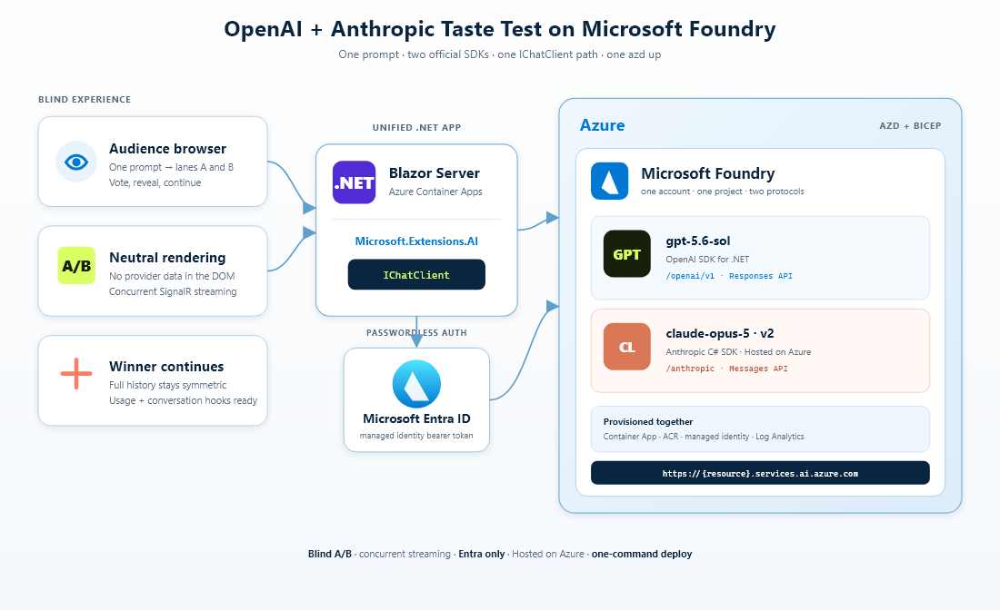
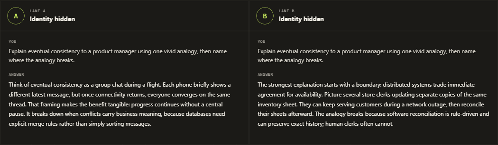

# OpenAI + Anthropic Taste Test on Microsoft Foundry

[](https://github.com/Azure-Samples/openai-anthropic-taste-test/actions/workflows/ci.yml)
[](LICENSE)
[](https://learn.microsoft.com/azure/developer/azure-developer-cli/)

A blind, side-by-side taste test of Claude and GPT models on Microsoft Foundry. The app uses the official Anthropic C# SDK and OpenAI SDK for .NET behind one `Microsoft.Extensions.AI.IChatClient` interface.



## See the experience

The page starts with one prompt box and two identity-free lanes labeled **A** and **B**. Both answers stream concurrently using the same typography and layout. After both finish, the audience picks a winner; only then does the page reveal the providers, model IDs, SDKs, and wire protocols. The winning lane remains for follow-up turns.



## Quickstart with `azd`

Start from the published template and go directly into provisioning:

```powershell
azd auth login
azd init --template openai-anthropic-taste-test --up
```

`azd init` creates an `openai-anthropic-taste-test` folder, then `--up` provisions and deploys it. The interactive flow asks for the Azure subscription, region, environment name, and Anthropic organization metadata. On an eligible subscription, the Bicep `modelProviderData` block accepts the Anthropic Marketplace offer automatically; no portal deployment step or API key is required.

Already cloned the repository? The complete path is one command:

```powershell
azd up
```

When deployment finishes, follow the printed `SERVICE_WEB_URI`.

### Unattended setup

Once browser authentication is cached, every deployment choice can be supplied up front:

```powershell
azd env new taste-test `
  --subscription <subscription-id> `
  --location eastus2 `
  --no-prompt

azd env set AZURE_TENANT_ID <tenant-id>
azd env set CLAUDE_ORGANIZATION_NAME "<legal-entity>"
azd env set CLAUDE_COUNTRY_CODE US
azd env set CLAUDE_INDUSTRY technology
azd provision --preview --no-prompt
azd up --no-prompt
```

The organization name is legal attestation data and is the only value the template will not guess.

### Agent-assisted setup

This repository includes the [`openai-anthropic-taste-test` Agent Skill](.github/skills/openai-anthropic-taste-test/SKILL.md) for GitHub Copilot CLI and compatible agents. From this workspace, ask:

> Set up and verify the OpenAI + Anthropic taste test with the least manual intervention.

The skill reuses cached authentication, resolves the azd environment, selects full Azure hosting when RBAC permits it or the no-role-assignment local mode when it does not, previews infrastructure, deploys, smoke-tests both models, verifies the blind DOM, and reports cleanup steps.

## What this template demonstrates

- One .NET 10 Blazor Server page with two neutral lanes, **A** and **B**.
- Server-side randomization per Blazor circuit; no provider name, model ID, CSS class, or element ID is emitted before reveal.
- Concurrent, throttled streaming over SignalR.
- GPT through the OpenAI **Responses API** and Claude through the Anthropic **Messages API**.
- A shared `IChatClient` orchestration path with symmetric, full-history turns.
- A winner reveal that collapses to one lane and continues that conversation.
- Passwordless Microsoft Entra authentication locally and managed identity in Azure.
- A single `azd up` path that provisions the app, observability, and both model deployments.

## Architecture

`azd up` creates:

| Resource | Purpose |
|---|---|
| Microsoft Foundry account and project | One AI endpoint and project for both model families |
| `gpt-5.6-sol` deployment | OpenAI Responses lane |
| `claude-opus-5` version 2 deployment | Anthropic Messages lane, Hosted on Azure |
| Azure Container App | Hosts the .NET 10 Blazor Server app |
| User-assigned managed identity | Authenticates the app to Foundry and Azure Container Registry |
| Azure Container Registry | Stores the application image built by `azd deploy` |
| Log Analytics workspace | Collects Container Apps platform and application console logs |

## Under the covers: two SDKs, one MEAI loop

The providers use their native wire protocols but meet at the `Microsoft.Extensions.AI` (`MEAI`) abstraction:

| Lane implementation | Native client | Foundry route | MEAI adapter |
|---|---|---|---|
| OpenAI SDK for .NET | `ResponsesClient` | `/openai/v1` Responses API | `Microsoft.Extensions.AI.OpenAI` |
| Anthropic C# SDK | `AnthropicFoundryClient` | `/anthropic` Messages API | Shipped in the `Anthropic` package |

Both credentials refresh Entra tokens automatically. The OpenAI SDK uses `BearerTokenPolicy`; the Anthropic Foundry credential takes the same `TokenCredential` directly:

```csharp
var credential = new DefaultAzureCredential();

IChatClient gpt = new OpenAIClient(
        new BearerTokenPolicy(credential, "https://ai.azure.com/.default"),
        new OpenAIClientOptions { Endpoint = new($"{endpoint}/openai/v1/") })
    .GetResponsesClient()
    .AsIChatClient(aoaiDeployment)
    .AsBuilder()
    .UseFunctionInvocation()
    .Build();

IChatClient claude = new AnthropicFoundryClient(
        new AnthropicFoundryIdentityTokenCredentials(credential, resourceName))
    .AsIChatClient(claudeDeployment)
    .AsBuilder()
    .UseFunctionInvocation()
    .Build();
```

After construction, the comparison loop is provider-neutral MEAI code. It sends both histories concurrently, streams normalized `ChatResponseUpdate` values, and folds each stream back into a `ChatResponse` so usage and conversation metadata are retained:

```csharp
await Task.WhenAll(lanes.Select(async lane =>
{
    lane.History.Add(new ChatMessage(ChatRole.User, prompt));
    var updates = new List<ChatResponseUpdate>();

    await foreach (var update in lane.Client.GetStreamingResponseAsync(
        lane.History,
        new ChatOptions { MaxOutputTokens = 900 },
        cancellationToken))
    {
        updates.Add(update);
        lane.Buffer.Append(update.Text);
        await requestThrottledRender();
    }

    ChatResponse response = updates.ToChatResponse();
    lane.History.AddMessages(response);
    lane.Usage = response.Usage;
    lane.ConversationId = response.ConversationId;
}));
```

## Prerequisites

- An Azure subscription eligible for the selected Anthropic Marketplace plan. Public production plans generally require a valid payment method; purpose-built test subscriptions can use an already accepted internal `*-test-plan`.
- Permission to create resources and role assignments in the subscription (`Owner` or `User Access Administrator` plus `Contributor`).
- Azure Marketplace purchase eligibility for Anthropic models.
- Quota for the requested GPT and Claude model deployments.
- [.NET 10 SDK](https://dotnet.microsoft.com/download/dotnet/10.0).
- [Azure Developer CLI](https://learn.microsoft.com/azure/developer/azure-developer-cli/install-azd) 1.17 or later.
- Docker only if you choose local container builds. The default `azd` configuration uses an ACR remote build.

Claude partner models do not support every subscription type. CSP, free-trial, student, credit-only, and some sponsored subscriptions can be ineligible. See [Deploy and use Claude models in Microsoft Foundry](https://learn.microsoft.com/azure/foundry/foundry-models/how-to/use-foundry-models-claude).

### If you cannot create role assignments

Azure hosting needs `Microsoft.Authorization/roleAssignments/write`, which `Contributor`, `Azure AI Developer`, and `Foundry Owner` do not grant. Ask for `Role Based Access Control Administrator` (or `Owner`) at subscription scope.

You do not have to wait for that. Local hosting mode provisions only the Foundry account and both model deployments, creates no role assignments, and runs the app on your machine under your own Entra identity:

```powershell
azd env set HOSTING_MODE local
azd env set ASSIGN_INFERENCE_ROLE_TO_DEPLOYER false
azd provision
./scripts/run-local.ps1
```

Use `azd provision` rather than `azd up`, because this mode intentionally deploys no Azure hosting. Your account still needs Foundry data access, which `Azure AI Developer`, `Foundry Owner`, or `Cognitive Services User` provides. Leave `ASSIGN_INFERENCE_ROLE_TO_DEPLOYER` at its default of `true` when you do hold RBAC-administration rights and want the template to grant that access for you.

Switch to Azure hosting later without recreating anything:

```powershell
azd env set HOSTING_MODE containerapp
azd up
```

## Deploy

The default `azd auth login` flow opens the enterprise browser sign-in. Device-code login is not required.

```powershell
azd auth login
azd up
```

During the first run, choose a subscription and a supported region, then provide the organization information required for the Anthropic Marketplace offer. For unattended runs, set it before `azd up`:

```powershell
azd env set CLAUDE_ORGANIZATION_NAME "Contoso"
azd env set CLAUDE_COUNTRY_CODE "US"
azd env set CLAUDE_INDUSTRY "technology"
azd up --no-prompt
```

The preprovision hook checks role-assignment permission and model quota when Azure CLI is installed and signed in, and reminds you about Marketplace eligibility. ARM performs authoritative validation even when that optional check is skipped.

After deployment, `azd` prints `SERVICE_WEB_URI`. Open that URL to run the taste test.

## Model and capacity overrides

The flagship defaults are current as of September 2, 2026:

| Setting | Default |
|---|---|
| `CLAUDE_MODEL_NAME` | `claude-opus-5` |
| `CLAUDE_MODEL_VERSION` | `2` (Hosted on Azure) |
| `CLAUDE_MODEL_CAPACITY` | `25` |
| `AOAI_MODEL_NAME` | `gpt-5.6-sol` |
| `AOAI_MODEL_VERSION` | `2026-07-09` |
| `AOAI_MODEL_CAPACITY` | `10` |
| `TASTE_TEST_MAX_OUTPUT_TOKENS` | `900` |

For a lower-latency rehearsal pair:

```powershell
azd env set CLAUDE_MODEL_NAME claude-sonnet-5
azd env set CLAUDE_MODEL_VERSION 2
azd env set AOAI_MODEL_NAME gpt-5.4-mini
azd env set AOAI_MODEL_VERSION 2026-03-17
azd provision
azd deploy
```

Verify model versions, regions, and quota in the Foundry model catalog before changing these values.

## Run locally

### Deterministic UI preview

No Azure resources or credentials are required:

```powershell
dotnet run --project src/TasteTest --launch-profile sample
```

### Against the provisioned Foundry account

Sign in with the Azure CLI or another `DefaultAzureCredential` developer credential, load the active `azd` environment, and start the app:

```powershell
./scripts/run-local.ps1
```

On macOS or Linux:

```bash
./scripts/run-local.sh
```

## Demo flow

1. Choose a prompt that invites explanation or judgment rather than fact recall.
2. Submit once; both lanes stream concurrently.
3. Ask the audience to vote.
4. Pick A or B to reveal the provider, model, SDK, and wire protocol.
5. Continue the conversation on the winning lane.

The included seed prompts are intentionally designed to expose differences in structure, judgment, and writing style.

## Costs

This template can incur charges for:

- Model input and output tokens.
- Azure Container Registry Basic.
- Azure Container Apps compute. The default keeps one replica warm for a reliable live demo.
- Log Analytics ingestion and retention.

For non-demo environments, allow the app to scale to zero:

```powershell
azd env set CONTAINER_MIN_REPLICAS 0
azd provision
```

Delete the environment and all resources when finished:

```powershell
azd down --purge --force
```

## Security

- The Foundry account has local/key authentication disabled.
- No API keys or connection strings are stored in the repository or app settings.
- The Container App uses a user-assigned managed identity with `Cognitive Services User`.
- The same identity receives only `AcrPull` on the container registry.
- Browser prompts stay in server-side Blazor circuit state and are sent directly to the selected model endpoints.
- Model output is rendered as encoded text; raw HTML is never trusted.

## SDK compatibility note

`Microsoft.Extensions.AI.OpenAI` 10.9.0 requires `OpenAI >= 2.12.0 && < 2.13.0`, so this template pins `OpenAI` 2.12.0 even though 2.13.0 is newer. `Anthropic` uses `12.*` so the latest compatible patch available from the configured NuGet feed is selected. `Anthropic.Foundry` has its own package version (`0.7.1`); it does not share the `Anthropic` package version.

## Validate changes

```powershell
dotnet test OpenAIAnthropicTasteTest.slnx
azd provision --preview
```

The tests verify concurrent dual-lane execution, usage capture, randomizable lane ordering, guarded reveal, and winner-only continuation.

## v2-ready hooks

The v1 experience intentionally keeps both providers stateless and sends full history. The code already:

- captures each terminal `ChatResponse.Usage` on the turn;
- stores a nullable `ConversationId` on each lane;
- injects both provider `HttpClient` transports through named `IHttpClientFactory` clients.

That leaves token/cost metering, protocol byte counting, and stateful-vs-stateless comparison additive rather than requiring an orchestration rewrite.

## Troubleshooting

### GPT deployment fails with insufficient quota

Lower `AOAI_MODEL_CAPACITY`, select another supported region, use a rehearsal model, or request quota in the Azure portal.

### Claude deployment is rejected

Confirm subscription Marketplace eligibility, organization metadata, and the Hosted on Azure model version. The `modelProviderData` block in Bicep auto-accepts the offer for eligible subscriptions.

### One lane returns 403

RBAC can take several minutes to propagate after first provision. Confirm that the app identity has `Cognitive Services User` on the Foundry account, then create a new Container Apps revision or retry.

### Provisioning fails with `Authorization failed ... roleAssignments/write`

Your account can create resources but not role assignments. Request `Role Based Access Control Administrator` at subscription scope, or use the local hosting mode described in [If you cannot create role assignments](#if-you-cannot-create-role-assignments).

### Claude deployment fails with `no valid payment method`

The subscription cannot purchase Marketplace offers. Anthropic models require an active paid billing instrument; Azure credits alone are not sufficient. Use a subscription with a payment method, or deploy only the OpenAI lane by pointing `CLAUDE_MODEL_NAME` at a model your subscription can provision.

### Streaming disconnects after scaling

This template fixes the Container App at one replica because Blazor Server circuit state is in memory. Add Azure SignalR Service and distributed session state before increasing `maxReplicas`.

## Resources

- [Claude models in Microsoft Foundry](https://learn.microsoft.com/azure/foundry/foundry-models/concepts/claude-models)
- [Deploy and use Claude models](https://learn.microsoft.com/azure/foundry/foundry-models/how-to/use-foundry-models-claude)
- [OpenAI .NET SDK](https://github.com/openai/openai-dotnet)
- [Anthropic C# SDK](https://github.com/anthropics/anthropic-sdk-csharp)
- [Microsoft.Extensions.AI](https://learn.microsoft.com/dotnet/ai/microsoft-extensions-ai)

## Contributing

This project welcomes contributions and suggestions. See [CONTRIBUTING.md](CONTRIBUTING.md).

## License

This project is licensed under the [MIT License](LICENSE).
